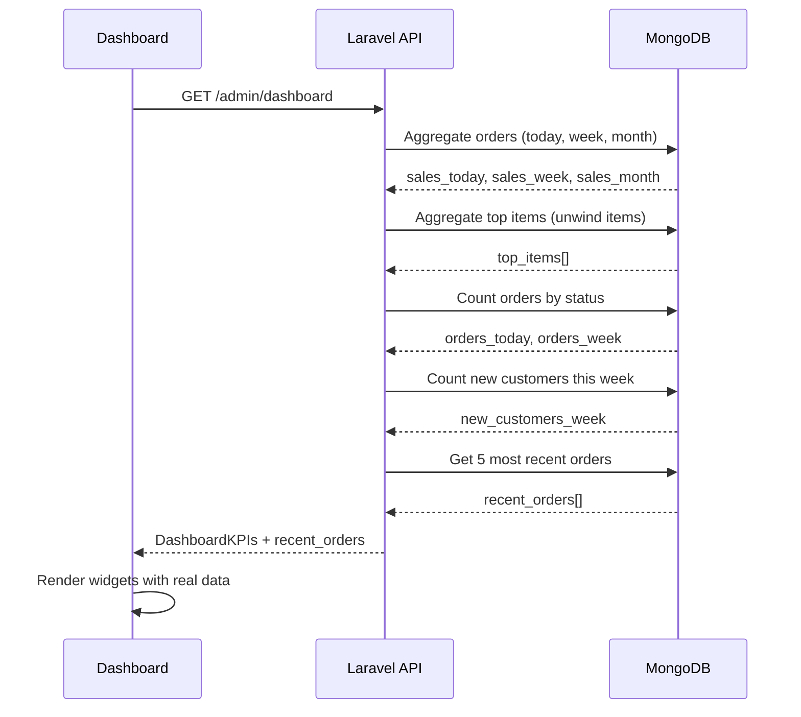
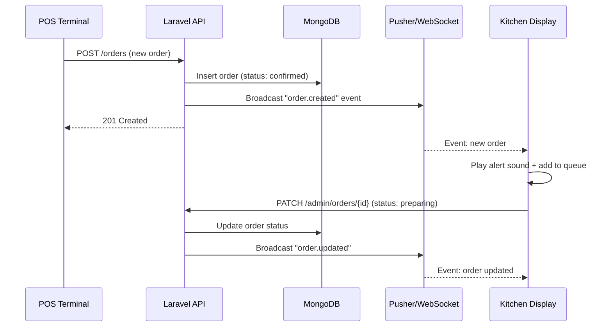
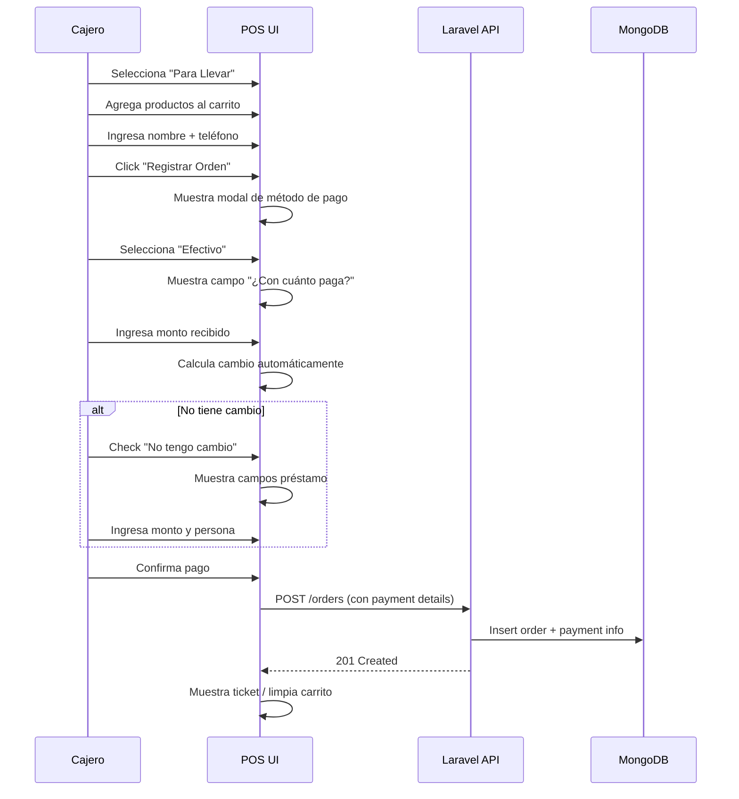
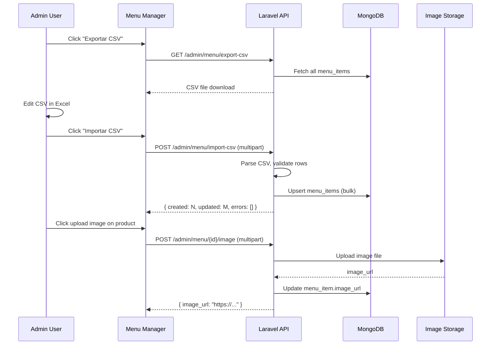

# Design Document: Mealli POS Release V2 — Sushi Queen Orlando

## Overview

Mealli POS V2 es una actualización mayor de la plataforma POS para Sushi Queen (Orlando). El sistema actual tiene un backend Laravel/Lumen con MongoDB y un frontend React/Vite/TypeScript. Muchas funcionalidades están parcialmente implementadas pero desconectadas de la base de datos, con widgets vacíos en el dashboard, KDS sin tiempo real, imágenes de productos rotas, y módulos como Reportes y Gastos sin funcionalidad completa.

Esta release aborda 17 mejoras organizadas en tres niveles de prioridad: Crítico (Dashboard + KDS en tiempo real), Importante (POS layout, filtros de canales, imágenes, métodos de pago), y Mejoras (clientes en POS, reportes avanzados, gastos, revenue, bulk edit de menú, inventario, promociones, insights). El objetivo es llevar la plataforma a un estado completamente funcional y conectado a MongoDB, con una UX inspirada en FUDO POS.

El stack tecnológico existente se mantiene: Laravel (PHP) como API backend, React + Vite + TypeScript como frontend, MongoDB como base de datos, JWT para autenticación, y Axios para comunicación HTTP. Se añadirá Laravel Echo + Pusher (o polling mejorado) para comunicación en tiempo real en el KDS.

## Architecture

```mermaid
graph TD
    subgraph Frontend["Frontend (React + Vite + TypeScript)"]
        Dashboard[Dashboard Page]
        POS[POS Page]
        KDS[Kitchen KDS]
        Reports[Reports Page]
        MenuMgr[Menu Manager]
        Customers[Customers Page]
        Delivery[Delivery Page]
        Expenses[Expenses Page]
        Insights[Insights Page]
        Promotions[Promotions Page]
    end

    subgraph API["Backend (Laravel / Lumen)"]
        AuthCtrl[Auth Controller]
        OrderCtrl[Order Controller]
        MenuCtrl[Menu Controller]
        CustomerCtrl[Customer Controller]
        ReportCtrl[Report Controller]
        ExpenseCtrl[Expense Controller]
        InsightsCtrl[Insights Controller]
        PromotionCtrl[Promotion Controller]
        TableCtrl[Table Controller]
        InventoryCtrl[Inventory Controller]
    end

    subgraph DB["MongoDB"]
        Orders[(orders)]
        MenuItems[(menu_items)]
        CustomersDB[(customers)]
        Tables[(tables)]
        Ingredients[(ingredients)]
        Recipes[(recipes)]
        Suppliers[(suppliers)]
        Promotions_DB[(promotions)]
        Expenses_DB[(expenses)]
        CashRegisters[(cash_registers)]
    end

    subgraph RealTime["Real-Time Layer"]
        Pusher[Pusher / WebSocket]
        Polling[Polling Fallback 5s]
    end

    subgraph Storage["File Storage"]
        ImageUpload[Image Upload - Cloudflare/S3]
        CSVExport[CSV Export/Import]
        FudoData[DatosFudo/*.xlsx]
    end

    Dashboard --> OrderCtrl
    Dashboard --> CustomerCtrl
    POS --> OrderCtrl
    POS --> MenuCtrl
    POS --> TableCtrl
    POS --> CustomerCtrl
    KDS --> OrderCtrl
    KDS --> Pusher
    KDS --> Polling
    Reports --> ReportCtrl
    MenuMgr --> MenuCtrl
    MenuMgr --> CSVExport
    MenuMgr --> ImageUpload
    Customers --> CustomerCtrl
    Delivery --> OrderCtrl
    Delivery --> CustomerCtrl
    Expenses --> ExpenseCtrl
    Insights --> InsightsCtrl
    Promotions --> PromotionCtrl

    OrderCtrl --> Orders
    OrderCtrl --> Pusher
    MenuCtrl --> MenuItems
    MenuCtrl --> ImageUpload
    CustomerCtrl --> CustomersDB
    ReportCtrl --> Orders
    ReportCtrl --> Expenses_DB
    ExpenseCtrl --> Expenses_DB
    InsightsCtrl --> Orders
    InsightsCtrl --> CustomersDB
    PromotionCtrl --> Promotions_DB
    TableCtrl --> Tables
    InventoryCtrl --> Ingredients
    InventoryCtrl --> Recipes
    InventoryCtrl --> Suppliers
```



## Sequence Diagrams

### Flujo 1: Dashboard — Carga de datos desde MongoDB



### Flujo 2: KDS — Recepción de órdenes en tiempo real



### Flujo 3: POS — Flujo de pago Para Llevar con efectivo



### Flujo 4: Menú — Bulk Edit via CSV



## Components and Interfaces

### Component 1: Dashboard Data Service

**Purpose**: Conectar el dashboard a MongoDB y poblar todos los widgets con datos reales.

**Interface (Backend)**:
```php
// OrderController::dashboard() — Respuesta mejorada
interface DashboardResponse {
    success: boolean;
    data: {
        sales_today: number;
        sales_week: number;
        sales_month: number;
        orders_today: number;
        orders_week: number;
        new_customers_week: number;
        top_items: { name: string; count: number; revenue: number }[];
        recent_orders: Order[];
        low_stock_alerts: { name: string; current_stock: number; min_stock: number; unit: string }[];
        orders_by_source: { source: string; count: number; revenue: number }[];
    };
}
```

**Responsibilities**:
- Agregar datos reales de MongoDB al endpoint `/admin/dashboard`
- Mapear la respuesta del backend al tipo `DashboardKPIs` del frontend
- El frontend ya consume este endpoint — solo necesita que el backend devuelva datos correctos

### Component 2: Real-Time KDS (Kitchen Display System)

**Purpose**: Implementar comunicación en tiempo real entre POS y Cocina.

**Interface (Frontend)**:
```typescript
// hooks/useKitchenOrders.ts
interface UseKitchenOrders {
  orders: Order[];
  loading: boolean;
  updateStatus: (orderId: string, status: OrderStatus) => Promise<void>;
  markItemPrepared: (orderId: string, itemIndex: number) => Promise<void>;
}

// Real-time event types
interface KitchenEvent {
  type: 'order.created' | 'order.updated' | 'order.deleted';
  order: Order;
}
```

**Interface (Backend)**:
```php
// Events/OrderCreated.php
class OrderCreated implements ShouldBroadcast {
    public Order $order;
    public function broadcastOn(): Channel {
        return new Channel('kitchen');
    }
}
```

**Responsibilities**:
- Broadcast eventos cuando se crea/actualiza una orden
- KDS escucha canal 'kitchen' via Pusher o polling mejorado (5s → 3s)
- Sonido de alerta cuando llega nueva orden
- Fallback a polling si WebSocket no disponible

### Component 3: POS Layout & Sales Channels

**Purpose**: Reorganizar mesas estilo FUDO y mover filtros de canales debajo del área de mesas.

**Interface**:
```typescript
// Tabs de canales de venta (reemplaza botones en panel derecho)
type SalesChannel = 'tables' | 'counter' | 'delivery' | 'express';

interface SalesChannelTab {
  id: SalesChannel;
  label: string;  // "Mesas" | "Mostrador" | "Delivery" | "Mostrador Express"
  icon: string;
}

// Table grid layout mejorado
interface TableGridProps {
  tables: Table[];
  zone: string;
  onSelectTable: (table: Table) => void;
  selectedTableId: string | null;
  tableHasItems: (id: string) => boolean;
}
```

**Responsibilities**:
- Tabs horizontales debajo del área de mesas: Mesas | Mostrador | Delivery | Mostrador Express
- Grid de mesas compacto y ordenado (como FUDO) en vez de disperso
- Cada canal muestra su vista correspondiente
- Mostrador y Mostrador Express son flujos sin mesa asignada

### Component 4: Payment Method Flow (Para Llevar)

**Purpose**: Agregar selección de método de pago al registrar orden para llevar.

**Interface**:
```typescript
interface PaymentDetails {
  method: 'credit_card' | 'debit_card' | 'cash';
  // Cash specific
  cash_received?: number;
  change_amount?: number;
  no_change?: boolean;
  borrowed_amount?: number;
  borrowed_from?: string;
  // Card specific
  card_last4?: string;
  card_approval?: string;
}

interface PaymentModalProps {
  total: number;
  onConfirm: (details: PaymentDetails) => void;
  onCancel: () => void;
}
```

**Responsibilities**:
- Modal de pago aparece al registrar orden para llevar
- Tres opciones: Tarjeta de crédito, Tarjeta de débito, Efectivo
- Efectivo: campo "¿Con cuánto paga?" + cálculo automático de cambio
- Checkbox "No tengo cambio" → campos "¿Cuánto pediste prestado?" y "¿A quién?"

### Component 5: Menu Bulk Edit (CSV Import/Export + Image Upload)

**Purpose**: Permitir edición masiva de productos via CSV y subida de imágenes.

**Interface (Backend)**:
```php
// MenuController — nuevos métodos
class MenuController {
    public function exportCsv(): Response;           // GET /admin/menu/export-csv
    public function importCsv(Request $req): JsonResponse;  // POST /admin/menu/import-csv
    public function uploadImage(Request $req, string $id): JsonResponse; // POST /admin/menu/{id}/image
}
```

**Interface (Frontend)**:
```typescript
interface MenuBulkActions {
  exportCSV: () => Promise<Blob>;
  importCSV: (file: File) => Promise<{ created: number; updated: number; errors: string[] }>;
  uploadImage: (menuItemId: string, file: File) => Promise<{ image_url: string }>;
}
```

**Responsibilities**:
- Exportar todos los productos a CSV (id, nombre, descripción, precio, categoría, imagen, disponible)
- Importar CSV para crear/actualizar productos masivamente
- Upload de imagen por producto (no URL, sino archivo)
- Tabla de productos con columnas: ID, Nombre, Categoría, Precio, Imagen (upload), Acciones

### Component 6: Expense Management

**Purpose**: Nueva plataforma para registrar gastos dentro de admin.

**Interface (Backend)**:
```php
// Models/Expense.php
class Expense extends Model {
    protected $collection = 'expenses';
    protected $fillable = [
        'description', 'amount', 'category', 'date',
        'payment_method', 'receipt_url', 'notes', 'created_by'
    ];
}

// ExpenseController
class ExpenseController {
    public function index(Request $req): JsonResponse;    // GET /admin/expenses
    public function store(Request $req): JsonResponse;    // POST /admin/expenses
    public function update(Request $req, $id): JsonResponse; // PUT /admin/expenses/{id}
    public function destroy($id): JsonResponse;           // DELETE /admin/expenses/{id}
    public function summary(Request $req): JsonResponse;  // GET /admin/expenses/summary
}
```

**Interface (Frontend)**:
```typescript
interface Expense {
  _id: string;
  description: string;
  amount: number;
  category: string;  // 'ingredientes' | 'servicios' | 'personal' | 'alquiler' | 'otros'
  date: string;
  payment_method: PaymentMethod;
  receipt_url?: string;
  notes?: string;
  created_by: string;
  created_at: string;
}
```

### Component 7: Reports & Revenue

**Purpose**: UI completa de reportes con gráficas y cálculo de revenue (Ventas - Gastos).

**Interface (Backend)**:
```php
// ReportController (nuevo)
class ReportController {
    public function salesReport(Request $req): JsonResponse;    // GET /admin/reports/sales
    public function revenueReport(Request $req): JsonResponse;  // GET /admin/reports/revenue
    public function customerReport(Request $req): JsonResponse; // GET /admin/reports/customers
    public function productReport(Request $req): JsonResponse;  // GET /admin/reports/products
}
```

**Interface (Frontend)**:
```typescript
interface RevenueData {
  period: string;
  total_sales: number;
  total_expenses: number;
  revenue: number;  // sales - expenses
  breakdown: {
    date: string;
    sales: number;
    expenses: number;
    revenue: number;
  }[];
}

interface SalesReportData {
  total_orders: number;
  total_revenue: number;
  avg_ticket: number;
  best_customer: { name: string; total_spent: number };
  best_product: { name: string; quantity: number; revenue: number };
  worst_product: { name: string; quantity: number };
  best_promotion: { title: string; usage_count: number; revenue: number };
  sales_by_day: { date: string; total: number; orders: number }[];
  sales_by_source: { source: string; total: number; orders: number }[];
  sales_by_type: { type: string; total: number; orders: number }[];
  top_products: { name: string; quantity: number; revenue: number }[];
  low_products: { name: string; quantity: number; revenue: number }[];
}
```

**Responsibilities**:
- Filtros: Hoy, Semana, Mes, Año + rango personalizado
- Gráficas: ventas por día/semana/mes, productos más/menos vendidos
- Métricas: mejor cliente, mejor producto, mejor promoción
- Revenue: Ventas - Gastos = Revenue (hoy, semanal, mensual, anual)

## Data Models

### Model: Expense (nuevo)

```typescript
interface Expense {
  _id: string;
  description: string;
  amount: number;
  category: 'ingredientes' | 'servicios' | 'personal' | 'alquiler' | 'marketing' | 'otros';
  date: string;
  payment_method: PaymentMethod;
  receipt_url?: string;
  notes?: string;
  created_by: string;
  created_at: string;
  updated_at: string;
}
```

**Validation Rules**:
- `description` requerido, max 255 chars
- `amount` requerido, numérico, > 0
- `category` requerido, debe ser uno de los valores del enum
- `date` requerido, formato ISO date
- `payment_method` requerido

### Model: Order (extensión para payment details)

```typescript
// Campos adicionales en Order existente
interface OrderPaymentExtension {
  payment_details?: {
    card_type?: 'credit' | 'debit';
    card_last4?: string;
    card_approval?: string;
    cash_received?: number;
    change_amount?: number;
    no_change?: boolean;
    borrowed_amount?: number;
    borrowed_from?: string;
    transfer_number?: string;
  };
}
```

### Model: Customer (extensión para vista mejorada)

```typescript
// Campos ya existentes que necesitan poblarse correctamente
interface CustomerViewExtension {
  total_orders: number;      // ya existe — asegurar que se actualiza
  total_spent: number;       // ya existe — asegurar que se actualiza
  last_order_at: string;     // ya existe — asegurar que se actualiza
  order_type: 'local' | 'delivery' | 'app';  // nuevo — reemplaza "source"
}
```

### Model: MenuItem (extensión para bulk edit)

```typescript
// Campos adicionales para gestión de menú
interface MenuItemBulkExtension {
  item_code?: string;        // ID visible para el admin
  image_file?: File;         // Para upload (no URL)
  sort_by_category?: boolean;
}
```

## Algorithmic Pseudocode

### Algorithm: Dashboard Data Aggregation

```php
// OrderController::dashboard() — Versión mejorada
public function dashboard(): JsonResponse
{
    $today = Carbon::today();
    $weekStart = Carbon::now()->startOfWeek();
    $monthStart = Carbon::now()->startOfMonth();

    // PRECONDITION: MongoDB connection is active
    // POSTCONDITION: Returns complete DashboardKPIs with real data

    // Step 1: Aggregate sales by period
    $salesToday = Order::where('created_at', '>=', $today)
        ->whereNotIn('status', ['cancelled'])
        ->sum('total');

    $salesWeek = Order::where('created_at', '>=', $weekStart)
        ->whereNotIn('status', ['cancelled'])
        ->sum('total');

    $salesMonth = Order::where('created_at', '>=', $monthStart)
        ->whereNotIn('status', ['cancelled'])
        ->sum('total');

    // Step 2: Count orders
    $ordersToday = Order::where('created_at', '>=', $today)->count();
    $ordersWeek = Order::where('created_at', '>=', $weekStart)->count();

    // Step 3: New customers this week
    $newCustomersWeek = Customer::where('created_at', '>=', $weekStart)->count();

    // Step 4: Top items (aggregate pipeline)
    $topItems = Order::raw(function ($collection) use ($monthStart) {
        return $collection->aggregate([
            ['$match' => [
                'created_at' => ['$gte' => new UTCDateTime($monthStart->getTimestamp() * 1000)],
                'status' => ['$nin' => ['cancelled']]
            ]],
            ['$unwind' => '$items'],
            ['$group' => [
                '_id' => '$items.name',
                'count' => ['$sum' => '$items.quantity'],
                'revenue' => ['$sum' => ['$multiply' => ['$items.price', '$items.quantity']]]
            ]],
            ['$sort' => ['count' => -1]],
            ['$limit' => 10],
        ]);
    });

    // Step 5: Recent orders
    $recentOrders = Order::orderBy('created_at', 'desc')->limit(5)->get();

    // Step 6: Format response matching DashboardKPIs type
    return response()->json([
        'success' => true,
        'data' => [
            'sales_today' => $salesToday,
            'sales_week' => $salesWeek,
            'sales_month' => $salesMonth,
            'orders_today' => $ordersToday,
            'orders_week' => $ordersWeek,
            'new_customers_week' => $newCustomersWeek,
            'top_items' => $topItems->map(fn($i) => [
                'name' => $i->_id,
                'count' => $i->count,
            ])->values(),
        ],
    ]);
}
```

**Preconditions**: MongoDB connection active, orders collection exists
**Postconditions**: Returns DashboardKPIs with non-null numeric values, top_items sorted by count desc
**Loop Invariants**: N/A (aggregation pipeline)

### Algorithm: KDS Real-Time Polling (Fallback)

```typescript
// hooks/useKitchenOrders.ts
function useKitchenOrders(): UseKitchenOrders {
  const [orders, setOrders] = useState<Order[]>([]);
  const [loading, setLoading] = useState(true);
  const prevCountRef = useRef(0);

  // PRECONDITION: User is authenticated
  // POSTCONDITION: orders[] contains all active kitchen orders, sorted by created_at

  const fetchOrders = useCallback(async () => {
    const { data } = await api.get<ApiResponse<Order[]>>('/admin/orders/kitchen');
    const list = Array.isArray(data.data) ? data.data : [];

    // Alert on new orders
    if (list.length > prevCountRef.current && prevCountRef.current > 0) {
      playAlertSound();
    }
    prevCountRef.current = list.length;
    setOrders(list);
    setLoading(false);
  }, []);

  useEffect(() => {
    fetchOrders();

    // Strategy 1: Try WebSocket (Pusher)
    try {
      const channel = pusher.subscribe('kitchen');
      channel.bind('order.created', (event: KitchenEvent) => {
        setOrders(prev => [event.order, ...prev]);
        playAlertSound();
      });
      channel.bind('order.updated', (event: KitchenEvent) => {
        setOrders(prev => prev.map(o =>
          o._id === event.order._id ? event.order : o
        ).filter(o => !['ready', 'delivered', 'cancelled'].includes(o.status)));
      });
      return () => pusher.unsubscribe('kitchen');
    } catch {
      // Strategy 2: Fallback to polling every 5 seconds
      const interval = setInterval(fetchOrders, 5000);
      return () => clearInterval(interval);
    }
  }, [fetchOrders]);

  return { orders, loading, updateStatus, markItemPrepared };
}
```

**Preconditions**: Authenticated user, API reachable
**Postconditions**: orders always reflects current kitchen state, new orders trigger audio alert
**Loop Invariants**: prevCountRef tracks previous order count for delta detection

### Algorithm: CSV Import for Menu Items

```php
// MenuController::importCsv()
public function importCsv(Request $request): JsonResponse
{
    // PRECONDITION: File is valid CSV with headers matching expected columns
    // POSTCONDITION: Menu items created/updated, returns count of operations

    $file = $request->file('csv');
    $rows = array_map('str_getcsv', file($file->getPathname()));
    $headers = array_shift($rows); // First row = headers

    $created = 0;
    $updated = 0;
    $errors = [];

    foreach ($rows as $index => $row) {
        $data = array_combine($headers, $row);

        // Validate required fields
        if (empty($data['name']) || !is_numeric($data['price'])) {
            $errors[] = "Row " . ($index + 2) . ": missing name or invalid price";
            continue;
        }

        $menuItem = [
            'name' => $data['name'],
            'description' => $data['description'] ?? '',
            'price' => (float) $data['price'],
            'category' => $data['category'] ?? 'General',
            'available' => ($data['available'] ?? '1') === '1',
        ];

        // Upsert: update if _id exists, create otherwise
        if (!empty($data['_id'])) {
            $existing = MenuItem::find($data['_id']);
            if ($existing) {
                $existing->update($menuItem);
                $updated++;
            } else {
                MenuItem::create($menuItem);
                $created++;
            }
        } else {
            MenuItem::create($menuItem);
            $created++;
        }
    }

    return response()->json([
        'success' => true,
        'data' => compact('created', 'updated', 'errors'),
    ]);
}
```

**Preconditions**: CSV file uploaded, headers include at least 'name' and 'price'
**Postconditions**: All valid rows processed, errors collected per row, no partial updates on validation failure per row
**Loop Invariants**: created + updated + errors.length == total rows processed

### Algorithm: Revenue Calculation

```php
// ReportController::revenueReport()
public function revenueReport(Request $request): JsonResponse
{
    // PRECONDITION: period param is one of: today, week, month, year
    // POSTCONDITION: revenue = total_sales - total_expenses for the period

    $period = $request->get('period', 'month');
    $startDate = match($period) {
        'today' => Carbon::today(),
        'week' => Carbon::now()->startOfWeek(),
        'month' => Carbon::now()->startOfMonth(),
        'year' => Carbon::now()->startOfYear(),
    };

    $totalSales = Order::where('created_at', '>=', $startDate)
        ->whereNotIn('status', ['cancelled'])
        ->sum('total');

    $totalExpenses = Expense::where('date', '>=', $startDate)->sum('amount');

    $revenue = $totalSales - $totalExpenses;

    // Daily breakdown
    $days = Carbon::now()->diffInDays($startDate);
    $breakdown = [];
    for ($i = 0; $i <= $days; $i++) {
        $date = $startDate->copy()->addDays($i);
        $daySales = Order::whereDate('created_at', $date)
            ->whereNotIn('status', ['cancelled'])
            ->sum('total');
        $dayExpenses = Expense::whereDate('date', $date)->sum('amount');
        $breakdown[] = [
            'date' => $date->toDateString(),
            'sales' => $daySales,
            'expenses' => $dayExpenses,
            'revenue' => $daySales - $dayExpenses,
        ];
    }

    return response()->json([
        'success' => true,
        'data' => [
            'period' => $period,
            'total_sales' => $totalSales,
            'total_expenses' => $totalExpenses,
            'revenue' => $revenue,
            'breakdown' => $breakdown,
        ],
    ]);
}
```

**Preconditions**: MongoDB connection active, expenses collection exists
**Postconditions**: revenue == total_sales - total_expenses, breakdown covers every day in period
**Loop Invariants**: Each day in breakdown is unique and sequential


## Key Functions with Formal Specifications

### Function: fixDashboardDataMapping (Frontend)

```typescript
// Dashboard.tsx — Fix data mapping to match backend response
function mapDashboardResponse(raw: any): DashboardKPIs {
  return {
    sales_today: raw?.sales_today ?? raw?.today?.revenue ?? 0,
    sales_week: raw?.sales_week ?? 0,
    sales_month: raw?.sales_month ?? raw?.month?.revenue ?? 0,
    orders_today: raw?.orders_today ?? raw?.today?.orders ?? 0,
    orders_week: raw?.orders_week ?? 0,
    new_customers_week: raw?.new_customers_week ?? raw?.total_customers ?? 0,
    top_items: (raw?.top_items || []).map((i: any) => ({
      name: i.name || i._id,
      count: i.count || i.quantity || 0,
    })),
  };
}
```

**Preconditions**: `raw` is the response from `/admin/dashboard` endpoint
**Postconditions**: Returns valid `DashboardKPIs` with all numeric fields >= 0, top_items is always an array
**Loop Invariants**: N/A

### Function: reorganizeTableGrid (Frontend)

```typescript
// POS.tsx — Compact grid layout for tables (FUDO style)
function renderCompactTableGrid(
  tables: Table[],
  zone: string,
  onSelect: (t: Table) => void,
  hasItems: (id: string) => boolean
): JSX.Element {
  const zoneTables = tables
    .filter(t => t.zone === zone)
    .sort((a, b) => a.number - b.number);

  const cols = Math.min(6, Math.ceil(Math.sqrt(zoneTables.length)));

  // Render as compact grid, no gaps, tables touching like FUDO
  return (
    <div className="grid gap-2" style={{ gridTemplateColumns: `repeat(${cols}, 1fr)` }}>
      {zoneTables.map(t => {
        const color = hasItems(t._id) ? 'bg-orange-500' :
          t.status === 'occupied' ? 'bg-red-500' : 'bg-green-500';
        return (
          <button key={t._id} onClick={() => onSelect(t)}
            className={`${color} text-white rounded-lg p-4 font-bold text-lg`}>
            {t.number}
          </button>
        );
      })}
    </div>
  );
}
```

**Preconditions**: `tables` is a valid array, `zone` matches at least one table
**Postconditions**: Tables rendered in compact grid sorted by number, correct color coding
**Loop Invariants**: All tables in zone are rendered exactly once

### Function: handleCashPayment (Frontend)

```typescript
// PaymentModal.tsx — Cash payment with change calculation
function calculateCashPayment(
  total: number,
  cashReceived: number,
  noChange: boolean,
  borrowedAmount?: number,
  borrowedFrom?: string
): PaymentDetails {
  const change = cashReceived - total;

  return {
    method: 'cash',
    cash_received: cashReceived,
    change_amount: Math.max(0, change),
    no_change: noChange,
    borrowed_amount: noChange ? borrowedAmount : undefined,
    borrowed_from: noChange ? borrowedFrom : undefined,
  };
}
```

**Preconditions**: `total > 0`, `cashReceived >= 0`
**Postconditions**: `change_amount >= 0`, if `noChange` is false then `borrowed_*` fields are undefined
**Loop Invariants**: N/A

### Function: uploadMenuImage (Backend)

```php
// MenuController::uploadImage()
public function uploadImage(Request $request, string $id): JsonResponse
{
    // PRECONDITION: $id is valid MenuItem ID, file is image (jpg, png, webp) <= 5MB
    // POSTCONDITION: image stored, menu_item.image_url updated

    $request->validate([
        'image' => 'required|image|mimes:jpg,jpeg,png,webp|max:5120',
    ]);

    $menuItem = MenuItem::findOrFail($id);
    $path = $request->file('image')->store('menu', 'public');
    $url = asset('storage/' . $path);

    $menuItem->update(['image_url' => $url]);

    return response()->json([
        'success' => true,
        'data' => ['image_url' => $url],
    ]);
}
```

**Preconditions**: Valid menu item ID, image file <= 5MB, format jpg/png/webp
**Postconditions**: Image stored in public storage, menu_item.image_url points to accessible URL
**Loop Invariants**: N/A

## Example Usage

### Dashboard — Fetching real data

```typescript
// Dashboard.tsx — Updated fetchData
const fetchData = async () => {
  setLoading(true);
  try {
    const [dashRes, ordersRes] = await Promise.all([
      api.get<ApiResponse<DashboardKPIs>>('/admin/dashboard'),
      api.get<ApiResponse<Order[]>>('/admin/orders', { params: { per_page: 5 } }),
    ]);

    // Map response to handle both old and new format
    const raw = dashRes.data.data || dashRes.data;
    setKpis(mapDashboardResponse(raw));
    setRecentOrders(Array.isArray(ordersRes.data.data) ? ordersRes.data.data.slice(0, 5) : []);
  } catch {
    // Handle error
  } finally {
    setLoading(false);
  }
};
```

### POS — Sales channel tabs

```typescript
// POS.tsx — Channel tabs below table area
const channels: SalesChannelTab[] = [
  { id: 'tables', label: 'Mesas', icon: '🪑' },
  { id: 'counter', label: 'Mostrador', icon: '🏪' },
  { id: 'delivery', label: 'Delivery', icon: '🛵' },
  { id: 'express', label: 'Mostrador Express', icon: '⚡' },
];

// In JSX:
<div className="flex border-b border-gray-200">
  {channels.map(ch => (
    <button key={ch.id}
      onClick={() => setActiveChannel(ch.id)}
      className={`flex-1 py-3 text-sm font-medium ${
        activeChannel === ch.id
          ? 'border-b-2 border-sushi-primary text-sushi-primary'
          : 'text-gray-500'
      }`}>
      {ch.icon} {ch.label}
    </button>
  ))}
</div>
```

### Expenses — Creating a new expense

```typescript
// Expenses.tsx
const createExpense = async (expense: Omit<Expense, '_id' | 'created_at' | 'updated_at'>) => {
  const { data } = await api.post('/admin/expenses', expense);
  setExpenses(prev => [data.data, ...prev]);
};

// Usage
await createExpense({
  description: 'Compra de salmón',
  amount: 450.00,
  category: 'ingredientes',
  date: '2025-06-15',
  payment_method: 'cash',
  notes: 'Proveedor: Pescados del Pacífico',
  created_by: user.id,
});
```

### Menu — CSV Export/Import

```typescript
// MenuManager.tsx — Bulk operations
const exportCSV = async () => {
  const response = await api.get('/admin/menu/export-csv', { responseType: 'blob' });
  const url = URL.createObjectURL(response.data);
  const a = document.createElement('a');
  a.href = url;
  a.download = 'menu-products.csv';
  a.click();
};

const importCSV = async (file: File) => {
  const formData = new FormData();
  formData.append('csv', file);
  const { data } = await api.post('/admin/menu/import-csv', formData, {
    headers: { 'Content-Type': 'multipart/form-data' },
  });
  alert(`Creados: ${data.data.created}, Actualizados: ${data.data.updated}`);
  if (data.data.errors.length > 0) {
    console.warn('Errores:', data.data.errors);
  }
  fetchMenu(); // Refresh
};
```

## Correctness Properties

*Una propiedad es una característica o comportamiento que debe mantenerse verdadero en todas las ejecuciones válidas del sistema — esencialmente, una declaración formal sobre lo que el sistema debe hacer. Las propiedades sirven como puente entre especificaciones legibles por humanos y garantías de corrección verificables por máquina.*

### Property 1: Dashboard KPIs siempre válidos

*Para cualquier* respuesta del backend (incluyendo campos nulos, faltantes o con formatos antiguos), la función `mapDashboardResponse` debe producir un objeto `DashboardKPIs` donde todos los campos numéricos (sales_today, sales_week, sales_month, orders_today, orders_week, new_customers_week) sean mayores o iguales a cero, y `top_items` sea siempre un array.

**Validates: Requirements 1.1, 1.2**

### Property 2: Top items ordenados descendentemente

*Para cualquier* lista de productos más vendidos retornada por el dashboard, los productos deben estar ordenados por cantidad vendida (`count`) de forma descendente, y la lista no debe exceder 10 elementos.

**Validates: Requirement 1.3**

### Property 3: Exclusión de órdenes canceladas en cálculos de ventas

*Para cualquier* conjunto de órdenes con estados variados, los cálculos de ventas totales (en dashboard y revenue) deben excluir todas las órdenes con estado "cancelled".

**Validates: Requirements 1.6, 17.5**

### Property 4: Filtrado de órdenes en KDS

*Para cualquier* conjunto de órdenes con estados variados, el KDS debe mostrar únicamente órdenes con estado "confirmed" o "preparing", ordenadas por `created_at` ascendente (la más antigua primero). Órdenes con estado "ready", "delivered" o "cancelled" nunca deben aparecer.

**Validates: Requirements 2.3, 2.6**

### Property 5: Grid de mesas — completitud y ordenamiento

*Para cualquier* zona con un conjunto de mesas, el grid debe renderizar cada mesa exactamente una vez (sin duplicados ni omisiones), ordenadas por número de mesa ascendente.

**Validates: Requirements 3.1, 3.4**

### Property 6: Cálculo de columnas del grid de mesas

*Para cualquier* número positivo de mesas en una zona, el número de columnas del grid debe ser igual a `min(6, ceil(sqrt(n)))` donde `n` es el total de mesas en la zona.

**Validates: Requirement 3.2**

### Property 7: Mapeo de colores de mesas

*Para cualquier* mesa, el color asignado debe ser: naranja si tiene productos en el carrito, rojo si está ocupada sin productos en carrito, y verde si está disponible. El mapeo debe ser determinístico y exhaustivo.

**Validates: Requirement 3.3**

### Property 8: Cálculo de cambio en pago efectivo

*Para cualquier* total mayor a cero y monto recibido mayor o igual a cero, el cambio calculado debe ser `max(0, monto_recibido - total)`, y el campo `change_amount` debe ser siempre mayor o igual a cero.

**Validates: Requirements 6.2, 6.6**

### Property 9: Campos de préstamo condicionales en pago

*Para cualquier* pago donde el método no es efectivo o donde `no_change` es falso, los campos `borrowed_amount` y `borrowed_from` deben ser `undefined`.

**Validates: Requirement 6.4**

### Property 10: Búsqueda parcial de clientes

*Para cualquier* término de búsqueda y base de datos de clientes, todos los resultados retornados deben coincidir parcialmente con el término por nombre o teléfono.

**Validates: Requirement 7.2**

### Property 11: Filtro de ventas por cliente

*Para cualquier* filtro de cliente aplicado en la vista de ventas, todas las órdenes retornadas deben pertenecer al cliente seleccionado, y el total acumulado debe ser igual a la suma de los totales de esas órdenes.

**Validates: Requirements 9.1, 9.2**

### Property 12: Validación de filas CSV en importación

*Para cualquier* archivo CSV importado, las filas sin campo "name" o con "price" no numérico deben ser rechazadas con un error que incluya el número de línea, mientras las filas válidas se procesan correctamente.

**Validates: Requirements 10.2, 10.3**

### Property 13: Idempotencia de importación CSV

*Para cualquier* conjunto de productos del menú, exportar a CSV e importar el mismo CSV no debe crear duplicados — productos con `_id` existente se actualizan, productos sin `_id` se crean.

**Validates: Requirements 10.4, 10.5**

### Property 14: Conteo de operaciones en importación CSV

*Para cualquier* importación CSV, la suma de `created + updated + errors.length` debe ser igual al número total de filas de datos en el CSV (excluyendo la fila de headers).

**Validates: Requirement 10.6**

### Property 15: Consistencia de datos de cliente

*Para cualquier* cliente, `total_orders` debe ser igual al conteo de órdenes donde `customer_id` coincide con el ID del cliente, y `total_spent` debe ser igual a la suma del campo `total` de esas órdenes.

**Validates: Requirements 12.2, 12.3**

### Property 16: Ordenamiento de productos en reportes

*Para cualquier* reporte de productos, la lista de "más vendidos" debe estar ordenada por cantidad descendente, y la lista de "menos vendidos" debe estar ordenada por cantidad ascendente.

**Validates: Requirement 15.4**

### Property 17: Validación de gastos

*Para cualquier* gasto, la descripción debe tener máximo 255 caracteres, el monto debe ser numérico y mayor a cero, la categoría debe pertenecer al conjunto {ingredientes, servicios, personal, alquiler, marketing, otros}, y la fecha debe estar en formato ISO válido.

**Validates: Requirements 16.2, 16.3**

### Property 18: Resumen de gastos por categoría

*Para cualquier* conjunto de gastos en un período, el resumen agrupado por categoría debe producir totales donde la suma de todas las categorías sea igual al total general de gastos del período.

**Validates: Requirement 16.7**

### Property 19: Fórmula de revenue

*Para cualquier* conjunto de órdenes (no canceladas) y gastos en un período, `revenue` debe ser exactamente igual a `total_ventas - total_gastos`.

**Validates: Requirement 17.1**

### Property 20: Consistencia del desglose diario de revenue

*Para cualquier* reporte de revenue con desglose diario, la suma de `revenue` de cada día del desglose debe ser igual al `revenue` total del período.

**Validates: Requirement 17.4**

## Error Handling

### Error Scenario 1: MongoDB Connection Failure

**Condition**: MongoDB is unreachable when dashboard/KDS/POS loads
**Response**: Backend returns 500 with `{ success: false, message: "Database connection error" }`
**Recovery**: Frontend shows cached data if available, falls back to FUDO JSON data files, displays "Conexión limitada" banner

### Error Scenario 2: CSV Import Validation Errors

**Condition**: CSV contains rows with missing required fields or invalid data types
**Response**: API processes valid rows, collects errors per invalid row with line number
**Recovery**: Returns `{ created: N, updated: M, errors: ["Row 5: missing name", ...] }`, UI displays error summary

### Error Scenario 3: Image Upload Failure

**Condition**: Image exceeds 5MB, wrong format, or storage service unavailable
**Response**: API returns 422 (validation) or 500 (storage error)
**Recovery**: Frontend shows error toast, product retains previous image_url (or "Sin imagen")

### Error Scenario 4: WebSocket Connection Lost

**Condition**: Pusher/WebSocket disconnects in KDS
**Response**: KDS detects disconnect event
**Recovery**: Automatically falls back to polling every 5 seconds, shows "Modo offline — actualizando cada 5s" indicator

### Error Scenario 5: Concurrent Order Updates

**Condition**: Two KDS terminals try to update the same order status simultaneously
**Response**: MongoDB's last-write-wins, both terminals receive updated state via next poll/event
**Recovery**: UI refreshes order list after any status update, ensuring consistency

## Testing Strategy

### Unit Testing Approach

- Test `mapDashboardResponse()` with various backend response formats (old format, new format, null fields)
- Test `calculateCashPayment()` with edge cases: exact amount, overpayment, zero, no-change scenario
- Test CSV parsing logic with valid/invalid rows, missing headers, empty file
- Test revenue calculation: sales - expenses for various periods
- Coverage goal: 80% for utility functions and data mapping

### Property-Based Testing Approach

**Property Test Library**: fast-check (already in vitest setup)

- **Dashboard KPIs**: For any valid MongoDB data, `mapDashboardResponse` always returns non-negative numbers
- **Cash Payment**: For any `total > 0` and `cashReceived >= 0`, `change_amount >= 0` and `change_amount == max(0, cashReceived - total)`
- **CSV Round-Trip**: Export → Import of same data produces identical menu items (idempotency)
- **Revenue**: For any set of orders and expenses, `revenue == sum(orders.total) - sum(expenses.amount)`

### Integration Testing Approach

- Test full dashboard endpoint with seeded MongoDB data
- Test order creation → KDS polling picks up new order
- Test CSV import endpoint with multipart upload
- Test expense CRUD operations
- Test image upload with actual file

## Performance Considerations

- **Dashboard**: Use MongoDB aggregation pipelines (already implemented) instead of loading all orders into memory. Cache KPIs for 30 seconds to reduce DB load.
- **KDS Polling**: 5-second interval is acceptable for fallback. WebSocket preferred for < 1s latency. Consider Server-Sent Events (SSE) as middle ground.
- **CSV Import**: Process in chunks of 100 rows to avoid memory issues with large menus. Use MongoDB bulk write operations.
- **Image Upload**: Compress images server-side before storage. Use WebP format when possible. Max 5MB per image.
- **Reports**: Pre-aggregate daily summaries in a `daily_stats` collection via scheduled job (cron) to avoid expensive real-time aggregations for year-long reports.

## Security Considerations

- **JWT Authentication**: All admin endpoints already protected by `jwt.auth` middleware — maintain this for new endpoints (expenses, reports, CSV import/export).
- **CSV Import Sanitization**: Validate and sanitize all CSV input to prevent injection attacks. Limit file size to 10MB.
- **Image Upload**: Validate MIME type server-side (not just extension). Store outside web root or use signed URLs.
- **Expense Access Control**: Only authenticated admin users can create/modify expenses. Log all expense operations for audit trail.
- **Rate Limiting**: Apply rate limiting to image upload and CSV import endpoints to prevent abuse.

## Dependencies

### Backend (nuevos)
- `pusher/pusher-php-server` — Para broadcasting de eventos en tiempo real (opcional, si se usa Pusher)
- `league/csv` — Para parsing robusto de CSV (opcional, PHP nativo funciona)
- `intervention/image` — Para compresión/resize de imágenes subidas

### Frontend (nuevos)
- `pusher-js` — Cliente WebSocket para KDS en tiempo real (opcional)
- `recharts` o `chart.js` — Para gráficas en Reportes (si no está ya incluido)
- `papaparse` — Para parsing de CSV en el frontend (export preview)

### Existentes (sin cambios)
- Laravel/Lumen + MongoDB (jenssegers/mongodb)
- React + Vite + TypeScript
- Tailwind CSS
- Axios
- Zustand (state management)
- JWT (tymon/jwt-auth)
