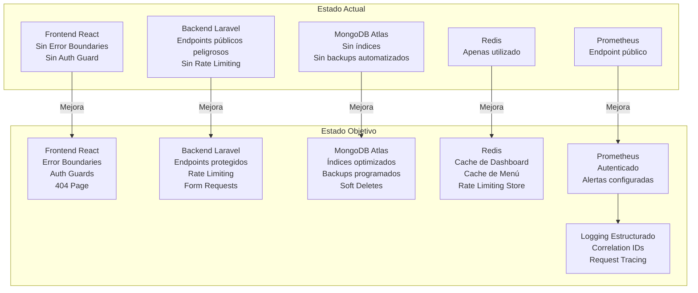
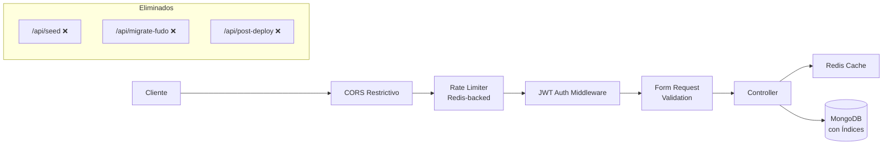

# Documento de Diseño: Mejoras de Preparación para Producción

## Resumen General

El sistema POS Sushi Queen + MealLi es una aplicación full-stack de restaurante con React 18/TypeScript en el frontend y PHP 8.2/Laravel 11 con MongoDB en el backend. Actualmente opera en producción sirviendo a un restaurante real, pero presenta vulnerabilidades críticas de seguridad, deficiencias en manejo de errores, falta de cobertura de tests, y problemas de observabilidad que ponen en riesgo la estabilidad y seguridad del sistema.

Este documento de diseño aborda 9 áreas de mejora organizadas por prioridad: seguridad, confiabilidad, rendimiento, testing, calidad de código, despliegue/DevOps, monitoreo, integridad de datos y mejoras de frontend. El objetivo es llevar el sistema a un estado de producción robusto sin cambiar la funcionalidad existente.

El alcance incluye hardening de seguridad (eliminación de endpoints públicos peligrosos, rotación de secretos, rate limiting), mejoras de confiabilidad (error boundaries, retry logic, códigos HTTP correctos), optimización de rendimiento (paginación, caching con Redis, índices MongoDB), expansión de testing (tests unitarios, integración, E2E), y mejoras de observabilidad (logging estructurado, alertas, métricas protegidas).

## Arquitectura

### Estado Actual vs. Estado Objetivo



### Arquitectura de Seguridad Objetivo



## Componentes e Interfaces

### Componente 1: Capa de Seguridad (Backend)

**Propósito**: Proteger todos los endpoints, eliminar vulnerabilidades críticas, implementar rate limiting y validación robusta.

**Interfaz**:
```php
// Nuevo Middleware: RateLimiter (usando Redis)
class RateLimitServiceProvider extends ServiceProvider
{
    public function boot(): void
    {
        RateLimiter::for('login', fn(Request $r) => Limit::perMinute(5)->by($r->ip()));
        RateLimiter::for('api', fn(Request $r) => Limit::perMinute(60)->by($r->user()?->id ?: $r->ip()));
        RateLimiter::for('public-orders', fn(Request $r) => Limit::perMinute(10)->by($r->ip()));
    }
}

// Nuevo Middleware: CorrelationId
class CorrelationId
{
    public function handle(Request $request, Closure $next): Response
    {
        // Agrega X-Correlation-ID a cada request/response
    }
}

// Nuevo Middleware: MetricsAuth  
class MetricsAuth
{
    public function handle(Request $request, Closure $next): Response
    {
        // Protege /api/metrics con token Bearer
    }
}
```

**Responsabilidades**:
- Eliminar endpoints `/api/seed`, `/api/migrate-fudo`, `/api/post-deploy` de rutas públicas
- Convertirlos en comandos Artisan protegidos
- Implementar rate limiting en login (5/min), API general (60/min), órdenes públicas (10/min)
- Proteger endpoint de métricas Prometheus con autenticación Bearer token
- Restringir CORS a dominios específicos con métodos explícitos
- Mover secretos hardcodeados a variables de entorno

### Componente 2: Validación y Form Requests (Backend)

**Propósito**: Extraer validación inline de controllers a clases Form Request dedicadas.

**Interfaz**:
```php
// Ejemplo: StoreOrderRequest
class StoreOrderRequest extends FormRequest
{
    public function authorize(): bool { return true; } // Endpoint público
    
    public function rules(): array
    {
        return [
            'items' => 'required|array|min:1',
            'items.*.menu_item_id' => 'required|string',
            'items.*.quantity' => 'required|integer|min:1',
            'customer.name' => 'required|string|max:255',
            'customer.phone' => 'required|string|max:50',
            // ... sanitización incluida
        ];
    }
}

// Form Requests a crear:
// - StoreOrderRequest, UpdateOrderRequest
// - StoreMenuItemRequest, UpdateMenuItemRequest  
// - StoreIngredientRequest, StoreRecipeRequest
// - StorePromotionRequest, StoreExpenseRequest
// - StoreSupplierRequest, StoreTableRequest
```

**Responsabilidades**:
- Crear Form Request para cada endpoint que recibe datos
- Incluir sanitización de input (strip_tags, trim)
- Validación a nivel de modelo además de controller

### Componente 3: Manejo de Errores y Confiabilidad (Backend)

**Propósito**: Estandarizar respuestas de error con códigos HTTP correctos, implementar retry logic para servicios externos.

**Interfaz**:
```php
// Trait para respuestas consistentes
trait ApiResponse
{
    protected function success($data, int $code = 200): JsonResponse;
    protected function error(string $message, int $code = 500, $errors = null): JsonResponse;
    protected function notFound(string $message = 'Resource not found'): JsonResponse;
    protected function validationError($errors): JsonResponse;
}

// Servicio con retry logic
class WhatsAppService
{
    public function sendWithRetry(string $to, string $message, int $maxRetries = 3): array;
}

// Handler de excepciones global mejorado
class Handler extends ExceptionHandler
{
    public function render($request, Throwable $e): Response
    {
        // Retorna JSON con código HTTP correcto para API requests
        // 404 para ModelNotFoundException
        // 422 para ValidationException
        // 500 para errores internos (sin exponer detalles en producción)
    }
}
```

**Responsabilidades**:
- Corregir controllers que retornan 200 en errores (especialmente `OrderController.index`)
- Implementar retry con backoff exponencial para WhatsApp y Gemini AI
- Resolver referencia a `FudoService` inexistente en `OrderController.store()`
- Configurar exception handler global para respuestas JSON consistentes

### Componente 4: Capa de Caché y Rendimiento (Backend)

**Propósito**: Utilizar Redis para caching estratégico y optimizar queries MongoDB.

**Interfaz**:
```php
// Estrategia de caché
class CacheStrategy
{
    // Dashboard: cache 5 min, invalidar en nueva orden
    public function dashboardKPIs(string $dateRange): array;
    
    // Menú público: cache 15 min, invalidar en cambio de menú
    public function publicMenu(): Collection;
    
    // Promociones activas: cache 30 min
    public function activePromotions(): Collection;
}

// Índices MongoDB a crear
// orders: { created_at: -1, status: 1 }, { customer_id: 1 }, { source: 1 }
// customers: { phone: 1 } (unique), { tier: 1 }, { created_at: -1 }
// menu_items: { category: 1, available: 1 }, { name: 1 }
// ingredients: { name: 1 }, { current_stock: 1 }
// product_sales: { date: -1 }, { product_name: 1 }
```

**Responsabilidades**:
- Implementar caching Redis para dashboard, menú público y promociones
- Agregar paginación a endpoints sin paginar (customers, ingredients, suppliers)
- Crear migration de índices MongoDB
- Refactorizar `OrderController.dashboard()` para usar aggregation pipeline única

### Componente 5: Error Boundaries y Auth Guards (Frontend)

**Propósito**: Proteger la UI contra crashes, implementar guardias de autenticación en rutas admin.

**Interfaz**:
```typescript
// Error Boundary global
interface ErrorBoundaryProps {
  children: React.ReactNode;
  fallback?: React.ReactNode;
}

// Auth Guard para rutas admin
interface AuthGuardProps {
  children: React.ReactNode;
  redirectTo?: string;
}

// Página 404
const NotFound: React.FC;
```

**Responsabilidades**:
- Crear componente ErrorBoundary global que capture errores de renderizado
- Crear componente AuthGuard que verifique JWT antes de renderizar rutas admin
- Crear página 404 para rutas no encontradas
- Agregar catch-all route `*` en React Router

### Componente 6: Observabilidad (Backend + Infra)

**Propósito**: Implementar logging estructurado, correlation IDs, y alertas.

**Interfaz**:
```php
// Formato de log estructurado
[
    'timestamp' => '2025-01-15T10:30:00Z',
    'level' => 'error',
    'correlation_id' => 'uuid-v4',
    'message' => 'Order creation failed',
    'context' => [
        'controller' => 'OrderController',
        'action' => 'store',
        'user_id' => '...',
        'duration_ms' => 150,
    ]
]

// Alertas Prometheus (prometheus/alerts.yml)
// - API error rate > 5% en 5 min
// - Response time p95 > 2s
// - MongoDB connection failures
// - Disk usage > 80%
```

**Responsabilidades**:
- Configurar logging JSON estructurado en Laravel
- Agregar middleware de correlation ID
- Crear reglas de alerta en Prometheus
- Proteger endpoint `/api/metrics` con autenticación

## Modelos de Datos

### Cambios en Modelos Existentes

```php
// Order: Agregar soft deletes
class Order extends Model
{
    use SoftDeletes;
    
    // Agregar índices
    protected $indexes = [
        ['created_at' => -1, 'status' => 1],
        ['customer_id' => 1],
    ];
}

// Customer: Agregar soft deletes
class Customer extends Model
{
    use SoftDeletes;
    
    // Agregar validación a nivel de modelo
    public static $rules = [
        'phone' => 'required|string|unique:customers',
        'name' => 'required|string|max:255',
        'email' => 'nullable|email',
    ];
}
```

**Reglas de Validación**:
- Phone de Customer debe ser único (índice unique en MongoDB)
- Order.total debe ser >= 0
- Order.status debe estar en lista de estados válidos
- MenuItem.price debe ser > 0

## Manejo de Errores

### Escenario 1: Servicio Externo No Disponible (WhatsApp/Gemini)

**Condición**: Llamada a WhatsApp Business API o Google Gemini falla
**Respuesta**: Retry con backoff exponencial (3 intentos: 1s, 2s, 4s)
**Recuperación**: Log del error, continuar flujo principal sin bloquear la operación del usuario

### Escenario 2: FudoService No Encontrado

**Condición**: `OrderController.store()` referencia `FudoService` que puede no existir
**Respuesta**: Verificar existencia de clase antes de instanciar, catch específico
**Recuperación**: Crear stub de FudoService o eliminar referencia si Fudo ya no se usa

### Escenario 3: MongoDB Connection Lost

**Condición**: Conexión a MongoDB Atlas se pierde temporalmente
**Respuesta**: Health check mejorado que verifica conectividad a DB
**Recuperación**: Retornar 503 Service Unavailable con mensaje descriptivo

### Escenario 4: Frontend Crash en Componente Admin

**Condición**: Error de JavaScript en cualquier componente admin
**Respuesta**: ErrorBoundary captura el error, muestra UI de fallback
**Recuperación**: Botón de "Reintentar" que recarga el componente, log del error a consola

## Estrategia de Testing

### Testing Unitario

**Backend (PHPUnit)**:
- Form Requests: validar reglas de cada request
- Modelos: validar casts, relaciones, scopes
- Services: WhatsAppService, InventoryService con mocks
- Trait ApiResponse: verificar formato de respuestas
- Meta: cubrir al menos 60% de controllers

**Frontend (Vitest)**:
- Stores Zustand: cart, auth, orders
- Hooks: useAuth, useAnalytics
- Componentes: ErrorBoundary, AuthGuard, NotFound
- Utils: formatters, validators

### Testing de Integración

**Backend**:
- Flujo completo de creación de orden (POST /api/orders → customer creado → stats actualizados)
- Flujo de autenticación (login → token → acceso admin → refresh → logout)
- Dashboard KPIs con datos de prueba
- CRUD completo de cada recurso admin

### Testing Property-Based

**Librería**: fast-check (frontend), PHPUnit con data providers (backend)

**Propiedades a verificar**:
- Order total siempre = sum(items.line_total)
- Customer tier siempre corresponde a total_orders
- Rate limiter nunca permite más de N requests en ventana

### Pipeline CI

- Eliminar `|| true` de comandos de test
- Fallar el build si tests no pasan
- Agregar step de lint (PHP CS Fixer, ESLint)

## Consideraciones de Rendimiento

- Dashboard: reducir de 5+ queries separadas a 1-2 aggregation pipelines + cache Redis 5 min
- Menú público: cache Redis 15 min (invalidar en cambio)
- Paginación obligatoria en todos los endpoints de listado admin (default 20, max 100)
- Índices MongoDB en campos de filtrado frecuente (created_at, status, phone, category)
- Frontend: prefetch de rutas admin más usadas (Dashboard, POS, Orders)

## Consideraciones de Seguridad

- **Crítico**: Eliminar `/api/seed` público (permite reseed completo de DB)
- **Crítico**: Eliminar secretos hardcodeados de `render.yaml` (JWT_SECRET, APP_KEY, MONGO_URI con credenciales)
- **Crítico**: Rotar todas las credenciales expuestas en el repositorio (MongoDB, JWT, APP_KEY, Fudo)
- **Alto**: Implementar rate limiting en login para prevenir brute force
- **Alto**: Proteger `/api/metrics` con autenticación
- **Alto**: Restringir CORS methods a GET, POST, PUT, PATCH, DELETE (no `*`)
- **Medio**: Agregar headers de seguridad (X-Content-Type-Options, X-Frame-Options, Strict-Transport-Security)
- **Medio**: Implementar CSP headers en frontend
- **Bajo**: Remover credenciales de admin del README

## Dependencias

- **Redis 7**: Ya configurado, necesita activación para caching y rate limiting
- **MongoDB Atlas**: Configuración de índices y backups automáticos
- **Prometheus + Grafana**: Ya desplegados, necesitan configuración de alertas y autenticación
- **PHPUnit**: Ya instalado, necesita más test cases
- **Vitest + fast-check**: Ya instalados en frontend, necesitan más test cases
- **Laravel Rate Limiting**: Built-in, solo necesita configuración
- **Laravel Form Requests**: Built-in, solo necesita crear clases
